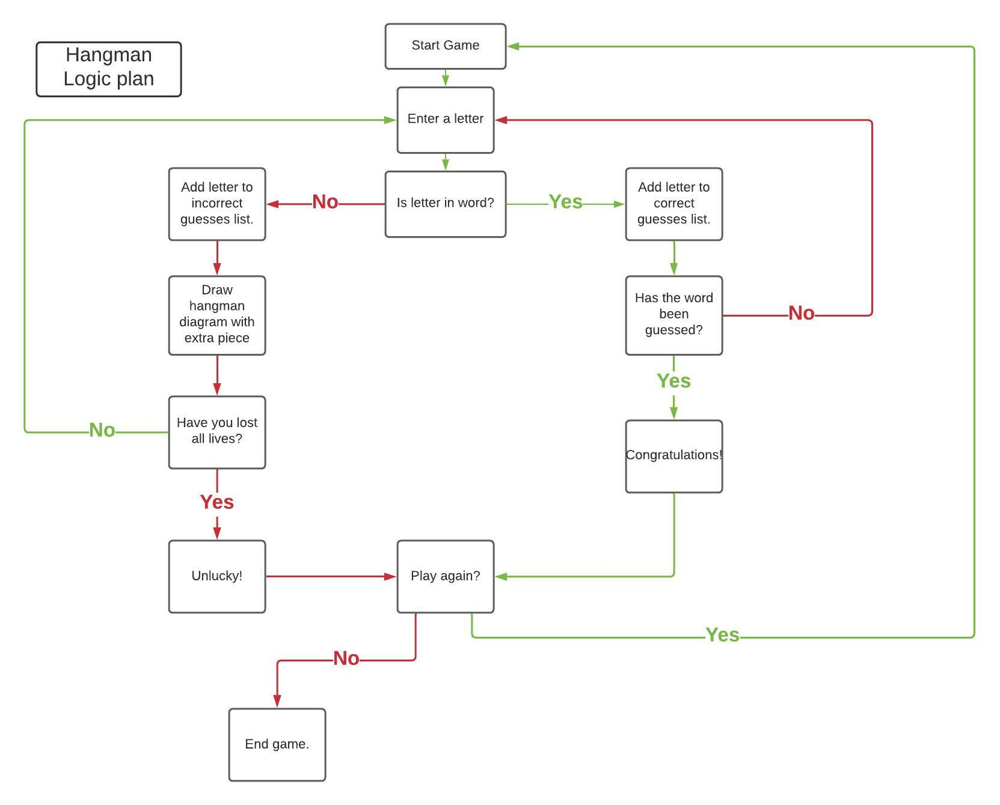
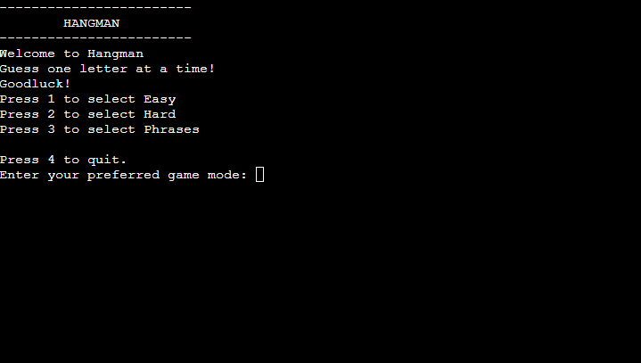
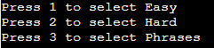
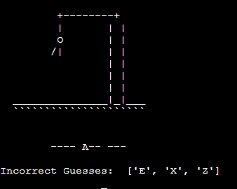
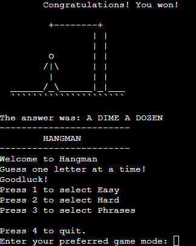
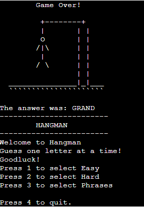
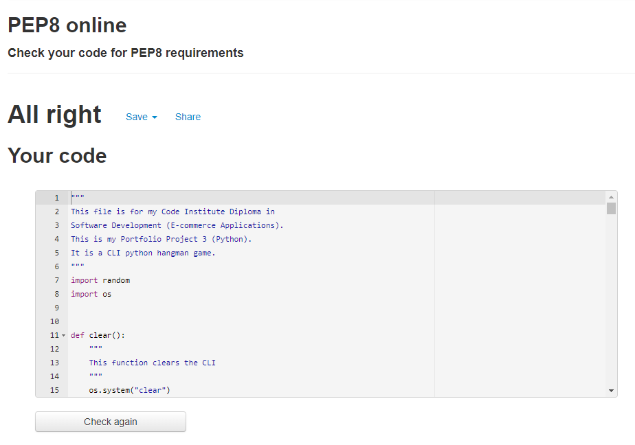
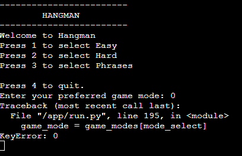
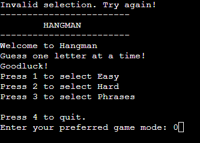

# **_Hangman_**

Hangman is a "guess the word" game where the player tries to guess a random word chosen by the program. The aim of the game is to guess the word within a limited number of lives before a digitial representation of the user is hung. The primary purpose of the game is for entertainment and can be played by both beginners and expert computer users. I chose to make this game as I knew it would be challenging while also being able to imlement a lot of the Python concepts I have learned so far.

This is the process behind <a href="https://hangman-game-pp3.herokuapp.com/" target="_blank" rel="noopener">Hangam</a>

# User Stories

* As a regular player I want to be kept entertained with a large vocabulary of words/phrases to guess that are not repeated often.
* As a computer novice I want to see clear instructions on how to play the game before I start.
* As a regular player of the classic game I do not want to lose attempts when guessed the same word or letter repeatedly.
* As a computer novice the game should be able to handle any keystroke error I make without needing further input from me.
* As a player of the classic game I expect the game to fill blank spaces with correct inputs to make it more entertaining and interactive.
* As a player I would like to see a graphical representation of the hangman images as in most versions of the game.
* As a player I would like to be able to track my progress and know how well I am playing the game.
* As a player I need to be able to restart the game quickly and easily.
* As an inexperienced user of command line interfaces, instructions on how to navigate the app should be readily available to me.

# How the game is played

* The program randomly selects a word/phrase depending on which difficulty the user has chosen.
* The word/phrase is displayed to the player as dashes, with each dash representing a letter of the word.
* Six attempts is given to the player to guess the word.
* For each correct letter guessed the placeholder dash will be replaced by the correct letter.
* For each incorrect guess, the number of attempts remaining reduces by one each time and the corresponding hangman graphic is displayed.
* The player wins when the secret word is guessed within six attempts, in which case a graphic of the man standing freely is displayed.
* The player loses if six attempts are made without guessing the secret word, in which case the final graphic of a whole man hanging from a gallow is displayed.
* The player then has a choice to play again or exit the game.

# Game Logic Plan

A flowchart was created before writing any code. This was then used to create the code and determine how the game should work.

# Features
## Existing Features
* ### Menu
    The game has a menu at the start. It allows the user to choose what game mode they would like to play. It also shows the player the instructions of the game. After the game has finished, the menu will re-appear to let them choose whether to play again or quit.

* ### Difficulty Choice
    The game creates a random word/phrase based on the difficulty chosen by the player. The game has 3 difficulties: Easy, Hard or Phrase. Easy is words with 5 letter or less, Hard is words with 6 letter or more and Phrase is a random Phrase with multiple words.

 

* ### Word/Phrase Generation
    The game random genrates a word/phrase based on the chosen difficulty. The list of words and phrases is large so that the chances of a repeating game are very low.

* ### Incorrect Guesses
    Incorrect guesses result in a new piece of the man being displayed in the graphic. Each incorrect guess is also shown to the player below the graphic. If a user trys to guess a letter they previously tried, no lives are deducted. The same goes for when they attempt a charcter that is not an english letter.

* ### Correct Guesses
    The game places all correct guesses into the displayed secret word. If the letter is featured in the word/phrase multiple times, it will display in all the places it should.

* ### Winning Screen
    If the player successfully guesses all the letter before their lives run out, they win. The player is congratulated, shown the correct word and a graphic of the man standing up safely. They are then prompted to either play again or quit.

* ### Losing Screen
    Similar to the winning screen only this displays when the player does not correctly guess the word/phrase. The user is shown the man hanging along with the correct answer.

* ### Error Handling
    * The program is not affected by keys not bound to a function.
    * The program will not process the entry of a characters that are not letters and will instead prompt the user to guess again.
    * Error-checking functionalityy handles user's operational errors such as pressing the wrong keys.

# Technologies Used

* [Python](https://www.python.org/) - The language used to create the apllication.
* [Heroku](https://www.heroku.com/) - Used for deployment and hosting the application.
* [Gitpod](https://www.gitpod.io/#get-started) - Online IDE used for processing the code.
* [Github](https://github.com/) - Remote hosting version control platform for recording changes made to code by storing it in a repository.
* [Lucidchart](https://www.lucidchart.com/pages/) - Used to create the flowchart.

# Testing

The application code was tested using the [PEP8 online code checker](http://pep8online.com/). The validation results are below:

# Testing User Stories
* As a regular player I want to be kept entertained with a large vocabulary of words/phrases to guess that are not repeated often.
    * The game can generate 100+ words/phrases.
* As a computer novice I want to see clear instructions on how to play the game before I start.
    * When the game starts the player is given clear instructions how to play.
* As a regular player of the classic game I do not want to lose attempts when guessed the same word or letter repeatedly.
    * The player does not lose lives for retrying letters.
* As a computer novice the game should be able to handle any keystroke error I make without needing further input from me.
    * Error handling and input validation functionalities prompts the user when input errors are made whilst the game is in progress without interrupting the game.
* As a player of the classic game I expect the game to fill blank spaces with correct inputs to make it more entertaining and interactive.
    * With each correct guess the placeholders are replaced by the correctly guessed letters.
* As a player I would like to see a graphical representation of the hangman images as in most versions of the game.
    * A new incomplete image of a hangman is displayed with every incorrect entry. A complete graphic of a man hanging from a gallow indicates the user has failed to guess the secret word within the number of allowed attempts. A man standing freely is shown when the user wins.
* As a player I would like to be able to track my progress and know how well I am playing the game.
    * The game clearly shows the pieces of the man being added to the graphic and all incorrect guesses are displayed to the user.
* As a player I need to be able to restart the game quickly and easily.
    * A player can restart the game quickly with a single keystroke which is displayed at the end of each game.
* As an inexperienced user of command line interfaces, instructions on how to navigate the app should be readily available to me.
    * Instructions on how the game is played is displayed upon entering the Heroku app website and clicking the run program button. At the end of the game the options available to the user are displayed within the terminal.

# Further Testing

The Hangman application site was tested and works on the following web browsers:
* Google Chrome
* Microsoft Edge
* Mozilla Firefox
* Safari

The Hangman application site was tested and works on the following devices:
* Moto G4
* Galaxy S5
* iPhone 5 / SE
* iPhone 6/7/8 (Plus)
* iPad / iPad Pro
* Displays < 1200px
* Displays > 1200px

User testing was carried out by Friends and family members in an effort to locate bugs and or user experience issues.

# Bugs
There were no errors/bugs in my code when testing in the PEP8 checker.
I did find one bug shortly before finishing my project which happened when a user entered 0 in the game menu. This was a key error and was fixed immediately and the application now informs the user that entering 0 is invalid.

Before:

After:

# Deployment

The game was deployed via an online terminal developed by Code institute known as Heroku, developed to facilitate deployment and host applications created using backend languages such Python. The deployment process is as follows:

1. Create new Heroku app from Heroku dashboard.
2. Name the app with a name that is available.
3. Choose the region from which you are from (Europe).
4. Select the create app button.
5. Select 'Settings' from the main menu.
6. Scroll to 'Config Vars' section and select 'Reveal Config Vars'.
7. In the 'Key' field input 'PORT' in the 'Value' field input '8000'.
8. Press 'Add' to add the value just entered.
9. Scroll down to 'Add buildpack' and select it.
10. Select 'Python' and save changes.
11. Select 'Add buildpack' again and do the same with 'NodeJs'.
12. Link the App to your repository.
13. Select deploy.

# Cloning
1. Go to https://github.com/
2. Log into account.
3. Click on the repository to be cloned.
4. Click the drop-down list arrow on the "Code" tab.
5. Click on the copy link icon next to the url of the repository.
6. Create a new repository and launch Gitpod to create a workspace from it.
7. In the gitpod terminal type: "git clone".
8. Paste the copied link and press enter.

# Credits
* Some of the concepts used were inspired by [Kylie Ying](https://youtu.be/cJJTnI22IF8)
* Some of the code used was inspired by a project done by [The Scottish Coder](https://www.youtube.com/channel/UCkezKNOIXYypA3UAY6Jjy-A)

# Acknowledgments
This application was created as a Portfolio Project 3 for the Full Stack Software Developer (e-Commerce) Diploma at the Code Institute. I would like to thank my mentor Precious Ijege, the Slack Community and everyone at the The Code Institute for their help and support.

Joey O'Sullivan 2022.